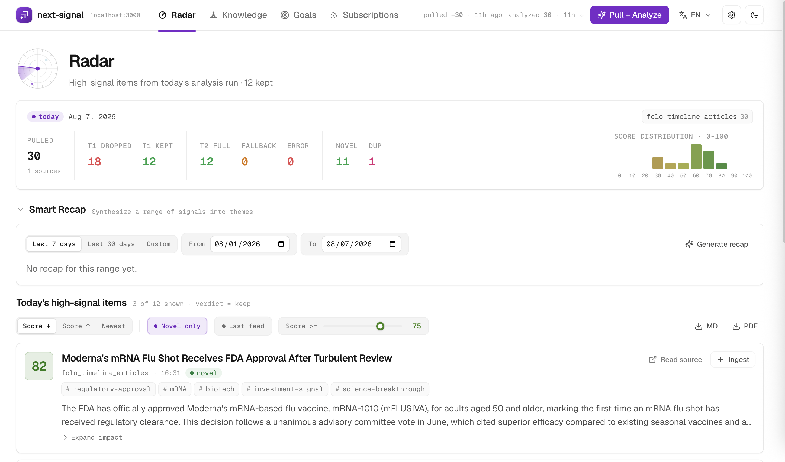

<div align="center">


# next-signal

**Decide what deserves your attention, then keep the best material in a
knowledge base you own.**

[English](./README.md) · [简体中文](./README.zh-CN.md)

<sub>Apache-2.0 · local-first · single-user · runs on your own machine</sub>

</div>

---

You follow hundreds of sources because the one important item could come from
anywhere. The queue grows faster than you can read it.

Summaries make each item shorter, but they do not decide which items deserve
your time. next-signal evaluates incoming material against a policy you can read
and edit. That policy describes what you are trying to understand, including
what should be excluded. For each item, the system asks:

> **How much should this change what I think or do?**

Relevance determines whether an item belongs. Evidence tells you how much to
trust its claims. The score is reserved for decision impact. The example policy
in this repository explicitly allows a released flagship model to outrank a
rigorous but narrow paper. Your policy can encode a different order.

<div align="center">
  
  <br />
  <sub>The radar reading view after a single run.</sub>
</div>

## How this compares

Every reader on this list has AI now. Feedly's Leo prioritizes and mutes topics,
Inoreader added multi-provider summarization and tagging, and Readwise's
Ghostreader works inside a document. Putting a language model on a feed stopped
being a differentiator somewhere in 2026. What none of them will tell you is
**why**.

| | Feedly Pro+ | Inoreader Pro | Readwise Reader | **next-signal** |
|---|:---:|:---:|:---:|:---:|
| Filters before you read | priority topics, mute | rules + AI tags | — | **goals + anti-goals** |
| The standard is a file you own | — | — | — | **versioned YAML** |
| Shows why each item was kept or cut | — | — | — | **stored, per item** |
| Filter quality measured on a labelled set | — | — | — | **55-item blind holdout** |
| Ranks by consequence, not relevance | — | — | — | **✔** |
| The same story from five feeds, once | rules | rules | — | **semantic, across runs** |
| Turns a period into themes you can check | — | — | — | **3-5, every citation validated** |
| Runs entirely on your own machine | — | — | — | **✔** |
| You pick the model it runs on | — | — | — | **✔ local / cloud / your CLI plan** |
| Spaced repetition on what you keep | — | — | ✔ | **✔ Ebbinghaus, zero model calls** |
| Library is plain markdown you own | — | — | — | **✔ Obsidian vault** |
| Price | $99/yr | $90/yr | $120/yr | **free self-host** |

<sub>Prices as of August 2026, annual billing.</sub>

Two more that a column cannot hold:

- **It runs without you.** A scheduler ships with the stack: set daily times and
  the radar pulls and analyses on its own. A run missed while the machine slept
  is skipped, or caught up once — your choice.
- **It breaks the language barrier.** A source is read in whatever language it
  was published in, and the analysis comes back in the one you picked — content
  language is set separately from interface language. The exception is a cleaned
  article body: it stays in the original, because your library holds the only
  copy of it.

The software is free under Apache-2.0. Local inference uses your hardware. Cloud
inference is billed by the provider.

**Scope, stated up front.** next-signal is a single-user tool. The dashboard has
no accounts and no authentication, it is built for the desktop rather than for
mobile, and it expects to run on your own machine — not on a public host.

---

## A real month: 978 items

These figures are one month of a personal feed, with no manual filtering between
pull and analysis:

| Count | Result | What it means |
|---:|---|---|
| **978** | pulled | everything the enabled sources returned |
| **568** | dropped at tier 1 | 58.1% did not justify full analysis |
| **409** | kept | cleared the relevance gate and received a full impact analysis |
| **133** | scored at least 75 | 13.6% reached the default high-signal view |

The system did not hide the middle. The 276 kept items that scored below 75 stay
available if you lower the threshold, and tier-1 drops retain their reasons.

<sub>977 of the 978 had finished analysis when these figures were taken. The
screenshot above is a single run; the totals here are a month of them.</sub>

### What it dropped

These are stored reasons from that month:

| The feed sent | Why it was dropped |
|---|---|
| HarmonyOS 7 Beta 2: AI-powered app fault analysis | *vendor tech blog, no new benchmark or capability data* |
| Cloudflare takes on AWS Route 53 in the DNS wars | *general cloud infrastructure launch, not core AI capability or inference optimization* |
| China's exports stay strong despite renewed US tensions | *macro export figures only, no company- or supply-chain-level verification* |
| Productizing the Honor YOYO agent \| AICon Shenzhen | *conference-attendance advertorial* |
| How the humble hot dog became a $100 delicacy | *entirely unrelated to AI, robotics, space, or scientific breakthroughs* |

The first headline contains **AI-powered** and still gets cut. The filter reads
the article, compares it with the reader's policy, and finds no information that
would change the reader's judgment.

### What it kept

> **dots-note-3.0 scores 42/42 under official IMO 2026 marking** · **92** ·
> `release` `benchmark` `reasoning` `agent` `math`
>
> Xiaohongshu's internal dots-note-3.0 received full credit on all six problems
> under official marking. Its 42/42 tied the seven human contestants who also
> earned a perfect score. The system used natural-language reasoning with Python
> assistance rather than a formal proof system such as Lean.
>
> [Published solutions](https://huggingface.co/datasets/dots-studio/dots-imo2026) ·
> [Official human results](https://www.imo-official.com/results/individual/year/2026/)

The same month kept an item from a completely different goal:

> **HORIZON-Breast01: SHR-A1811 in HER2-positive advanced breast cancer** ·
> **88** · `clinical-trial` `regulatory-approval` `oncology` `adc`
>
> A phase 3 interim analysis in *The Lancet Oncology* reported median PFS of
> 30.6 months versus 8.3 months with standard care (HR 0.22), with an ORR of
> 81.7%. China approved the drug in March 2026 for second-line or later
> HER2-positive advanced breast cancer.
>
> [Trial report](https://www.sciencedirect.com/science/article/pii/S1470204526001932) ·
> [Company results](https://www.hengrui.com/images/investor/%E6%81%92%E7%91%9E%E9%86%AB%E8%97%A5%202025%E5%B9%B4%E5%A0%B1.pdf)

The science policy below requires a named phase, concrete results, and a
clinical or engineering action that has already happened. This item clears that
gate.

---

## What the week added up to

133 items cleared 75 that month. Reading 133 summaries is still reading.

A recap takes a date range and returns 3-5 themes. A theme is a claim across
several items — "three labs cut inference prices in the same week" — not a
bucket for items that happen to share a tag. Restating each item in turn is
explicitly not a recap, and the prompt says so.

```bash
next-signal info-radar recap --since 2026-07-25 --until 2026-07-31 --min-score 65 --novel-only
```

That range held 59 kept items. One of the five themes it returned:

> **The compute cost war, and the split in who can turn it into revenue**
>
> Commercial paths have visibly diverged: the majors are building a moat out of
> aggressive cost optimization and vertical deployment, while the bubble around
> the pure model race deflates. OpenAI and Anthropic cut prices sharply — up to
> 80% — and shipped fuel-efficient models tuned for agent workflows, betting
> that a lower token cost is what activates high-frequency agent use. Microsoft
> closed a clear monetization loop through Azure and Copilot, while Meta's cash
> flow fell under heavy capital expenditure with no enterprise model to show for
> it. Google, meanwhile, lost market value to a delayed flagship and fell back on
> a low-cost Flash release. The market's attention has moved from raw capability
> scores to output per token and willingness to pay in a real scenario; models
> that stack parameters without a business loop now face a survival problem.
>
> <sub>Rests on 5 cited items. Headline for the period: *"AI agents move from
> solving problems to acting on their own, while safety and engineering hit hard
> reality."*</sub>

Every theme has to cite the items it stands on, and the citations are checked
against the ids actually sent to the model. An invented id is discarded; a theme
left with no surviving citation is dropped whole rather than printed. Recaps are
cached by range, score floor, and novel-only, so reopening one costs nothing, and
a range with no items returns without calling a model at all.

---

## The filter is inspectable

Its quality does not rest on the phrase "AI-powered filtering." You can inspect
the standard, the decision attached to each item, and the tests used to tune it.

### 1. The standard is a file you own

`configs/info_radar/goals.yaml` is an editorial policy, not a row of topic
sliders. It supports anti-goals and hard vetoes, lives in version control, and is
editable from the dashboard:

```yaml
- name: science_breakthrough
  description: |
    Track major scientific and medical breakthroughs outside AI. …
    Hard veto list: any one of these means it is not a breakthrough,
    regardless of how important it sounds:
      (1) the subject is animals, cells, or organoids, with no human result;
      (2) the conclusion says "may", "promising", "potential", or "preclinical";
      (3) it cannot name an action that has already happened, such as approval,
          phase III entry, installation, shipment, or inclusion in guidelines;
      (4) it is mechanism discovery, drug repurposing, a single cohort,
          or an epidemiological correlation.
    This is a hard gate, not a preference. Rhetoric is not evidence.
```

This is where you can write a rule as specific as "a Nature byline is not by
itself a breakthrough." The policy can be written in any language because the
model reads it as prose.

### 2. Changes are measured on labelled sets

`scripts/radar_eval.py` replays the production pipeline against three sets: 60
adversarial cases, 36 decision-boundary cases, and a 55-item holdout. Three
independent model annotators labelled the holdout after reading `goals.yaml` and
nothing from the production prompts; only unanimous cases were retained. This
is a model-consensus reference set, not a human-labelled benchmark.

Article content is snapshotted before replay, so upstream fetch variation does
not contaminate prompt comparisons. Each run records a hash of both prompts and
the goals file.

On this holdout, the production configuration passed **75%** of cases. When a
run uses repeats, a case passes only when every repeat returns the expected
keep/drop verdict and, for kept items, the mean score lands inside the expected
band. This result applies to this goals file and corpus; it is not a universal
accuracy claim.

### 3. Failed experiments stay in the record

One tuning round improved the adversarial set while taking the holdout pass rate
from 75% to **40%**. The change was rejected. The prompts, measurements, and
reason for the regression are documented in
[`docs/modules/info_filter.md`](./docs/modules/info_filter.md#tuning-and-evaluation).

That record matters because a personal filter can look better on familiar
examples while getting worse on the next batch. The holdout caught exactly that.

---

## Signal is only half of it

Filtering decides what reaches you. The knowledge pipeline decides what stays
useful after you close the tab.

```text
╭──────────────────────────────────────────────╮
│  sources                                     │
╰──────────────────────┬───────────────────────╯
                       │
┌──────────────────────▼───────────────────────┐
│  radar                                       │
│    score by decision impact                  │
│    deduplicate across runs                   │
│    recaps on demand                          │
└──────────────────────┬───────────────────────┘
                       │
╭──────────────────────▼───────────────────────╮
│  you read it                                 │
╰──────────────────────┬───────────────────────╯
                       │
┌──────────────────────▼───────────────────────┐
│  ingest                                      │
│    fetch · clean · summarize                 │
│    file into your taxonomy                   │
└──────────────────────┬───────────────────────┘
                       │
┌──────────────────────▼───────────────────────┐
│  markdown                                    │
│    files on your disk                        │
│    hybrid search                             │
└──────────────────────┬───────────────────────┘
                       │
┌──────────────────────▼───────────────────────┐
│  review                                      │
│    days 1, 3, 7, 15, 30, 60, 120             │
└──────────────────────────────────────────────┘
```

One click or command saves a radar item as a long-term knowledge entry. The
pipeline fetches and cleans the source, writes a summary, files it into your
taxonomy, indexes it for hybrid search, and schedules it to resurface on days 1,
3, 7, 15, 30, 60, and 120.

The library is **plain markdown in a folder you own**. It works as an Obsidian
vault, but Obsidian is optional. You choose whether to sync it with Git, another
sync tool, or nothing at all. The library needs no export step because the files
are already yours.

Knowledge ingest currently accepts web articles, YouTube, Bilibili, WeChat
Official Accounts, GitHub repositories, PDFs, and Office files. Radar inputs are
configured as source adapters under `configs/info_radar/sources.yaml`, so new
sources do not change the filtering or knowledge layers.

---

## Quick start

Docker Compose brings up Postgres with pgvector, the schema, the dashboard, and
the scheduler. The helper CLIs are already in the image.

```bash
git clone https://github.com/OpenCraft-AI-Lab/next-signal.git
cd next-signal
cp .env.example .env
$EDITOR .env                 # set WIKI_DIR and WIKI_RAW_DIR
docker compose up --build
```

Then open <http://localhost:3000> and finish setup on the settings page.

Only two values are required before the stack starts: `WIKI_DIR` and
`WIKI_RAW_DIR`, absolute host paths for the clean markdown library and the raw
archive. Everything else has a default or belongs to a source adapter you have
not enabled yet; the full list with comments is in
[`.env.example`](./.env.example).

**Then pick where the models run.** This choice lives in the dashboard rather
than in `.env`, and it applies to the next job without a restart:

| Path | What it means |
|---|---|
| **Local model** | Any OpenAI-compatible server you run yourself — MLX, llama.cpp, vLLM, Ollama. The dashboard needs only its URL and a model name; run the server on the host rather than inside the container so it reaches the GPU. With a local embedder as well, no prompt, goal, or article body goes to a third-party model API. |
| **DeepSeek** | No local GPU needed. A measured 100-item run cost roughly **$0.07 / ¥0.5** — an estimate, not a price; it moves with article length, cache hits, and the provider's [current rates](https://api-docs.deepseek.com/quick_start/pricing/). |
| **Codex CLI / Claude Code CLI** | If you are already signed in to one, analysis is billed to that subscription instead of an API key. Stages run in an empty throwaway directory with tools disabled, so a CLI engine reads nothing from your repository. |

One engine serves a whole job; a configured fallback may replace an unreachable
primary only before the first successful response, never mid-job. The embedder
behind duplicate detection is chosen separately — a local model, OpenAI, or any
other OpenAI-compatible endpoint you supply.

### Day to day

```bash
docker compose exec dashboard next-signal doctor      # inspect the configured stack
docker compose run --rm dashboard next-signal info-radar pull
docker compose run --rm dashboard next-signal info-radar analyze
```

You will rarely run those. Once you set daily times on the settings page, the
`scheduler` container runs pull and then analysis on its own — the one path in
the whole system that spends model tokens without you asking for it. A run
missed while the machine slept is skipped by default, or caught up once; the
settings page reports where the last run stands, including while it is still
going.

The rest — the environment reference, host-native installation, the schedule
file and its catch-up rules, and the full CLI — lives in
[`docs/operations.md`](./docs/operations.md) and
[`docs/containerized-deployment.md`](./docs/containerized-deployment.md).

---

## Documentation

| You want to… | Read |
|---|---|
| Understand the architecture and its trade-offs | [docs/architecture.md](./docs/architecture.md) |
| Add an agent, tool, integration, model, or domain | [docs/development.md](./docs/development.md) |
| Install, configure the environment, run `next-signal doctor`, or troubleshoot | [docs/operations.md](./docs/operations.md) |
| Deploy in containers | [docs/containerized-deployment.md](./docs/containerized-deployment.md) |
| Read the filter design and tuning record | [docs/modules/info_filter.md](./docs/modules/info_filter.md) |
| Read the knowledge pipeline design | [docs/modules/knowledge.md](./docs/modules/knowledge.md) |
| Read capability contracts or pending changes | [openspec/specs/](./openspec/specs/) · [openspec/changes/](./openspec/changes/) |

**Docs are bilingual.** English is canonical. The Chinese mirrors live in
[`docs/zh/`](./docs/zh/), [`README.zh-CN.md`](./README.zh-CN.md), and
[`dashboard/README.zh-CN.md`](./dashboard/README.zh-CN.md). Each page has a
language switcher. `CLAUDE.md` and `openspec/specs/` are deliberately kept in a
single language because they change with the code and a second copy would drift.

## Built with

[Agno](https://github.com/agno-agi/agno) for the agent runtime ·
[gbrain](https://github.com/garrytan/gbrain) for markdown-first hybrid search
and the typed-link graph · Postgres + pgvector · Next.js · Qwen3 on
[MLX](https://github.com/ml-explore/mlx) for local inference.

Apache-2.0.
