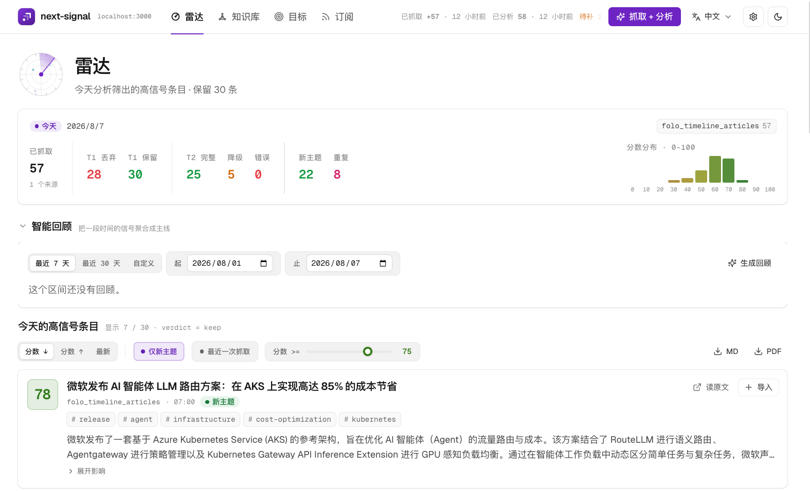

<div align="center">


# next-signal

**判断什么值得占用你的注意力，再把重要内容存进你自己的知识库。**

[English](./README.md) · [简体中文](./README.zh-CN.md)

<sub>Apache-2.0 · 本地优先 · 单用户 · 跑在你自己的机器上</sub>

</div>

---

你订阅了几百个信息源，因为真正重要的那一条可能来自任何地方。结果是，待读列表越积
越长，你根本看不过来。

摘要只能让每条内容变短，不能替你判断什么值得花时间。next-signal 会按照一份你能读、
能改的策略评估新内容。这份策略写明你正在研究什么，也写明哪些内容应该被排除。面对
每一条信息，系统只问一个问题：

> **这条信息会在多大程度上改变我的判断或行动？**

相关性决定一条内容是否属于你的关注范围，证据决定其中的结论有多可信，分数则只衡量
它对判断和行动的影响。仓库里的示例策略明确规定，已经发布的旗舰模型可以排在一篇严谨
但影响范围很窄的论文之前。你也可以写出完全不同的排序标准。

<div align="center">
  
  <br />
  <sub>单次运行之后的雷达阅读视图。</sub>
</div>

## 和市面上的产品比

这张表上每一个阅读器现在都有 AI。Feedly 的 Leo 会做优先级和静音，Inoreader 上了
多 provider 的摘要与打标，Readwise 的 Ghostreader 在单篇文档里工作。把语言模型接到
feed 上，大概在 2026 年的某个时候就不再是差异点了。它们都不会告诉你的是：**为什么**。

| | Feedly Pro+ | Inoreader Pro | Readwise Reader | **next-signal** |
|---|:---:|:---:|:---:|:---:|
| 在你读之前就过滤 | 优先话题、静音 | 规则 + AI 打标 | — | **目标 + 反目标** |
| 判断标准是你自己拥有的文件 | — | — | — | **进 git 的 YAML** |
| 告诉你每条为什么被留下或砍掉 | — | — | — | **逐条存了理由** |
| 过滤质量在标注集上被测量 | — | — | — | **55 条盲标 holdout** |
| 按后果排序，而不是相关性 | — | — | — | **✔** |
| 同一条新闻来自五个源，只出现一次 | 规则 | 规则 | — | **语义去重，跨次运行** |
| 把一个区间收成能核对的主线 | — | — | — | **3-5 条，引用逐条校验** |
| 可以完全跑在自己机器上 | — | — | — | **✔** |
| 模型跑在哪里由你选 | — | — | — | **✔ 本地 / 云 / 你的 CLI 订阅** |
| 对留下的内容做间隔重复 | — | — | ✔ | **✔ 艾宾浩斯，零模型调用** |
| 资料库是你自己的纯 markdown | — | — | — | **✔ Obsidian vault** |
| 价格 | $99/年 | $90/年 | $120/年 | **自托管免费** |

<sub>价格为 2026 年 8 月的年付价。</sub>

还有两点是一列装不下的：

- **不用你盯着它也会跑。** 整个栈自带调度器：设好每日时间点，雷达就会自己拉取和
  分析。机器睡过去而错过的那次，是跳过还是补跑一次，由你决定。
- **打破语言壁垒。** 文章用它本来的语言被读，分析和摘要用你选的语言回来——内容语言
  和界面语言分开设置。唯一的例外是清洗后的正文：它保持原文语言不变，因为你的知识库
  里存的是它唯一的一份副本。

软件以 Apache-2.0 免费提供。本地推理使用你的硬件，云推理费用由模型提供商收取。

**先说清楚适用范围。** next-signal 是单用户工具。网页控制台没有账号体系、没有鉴权，
面向桌面而不是移动端，预期跑在你自己的机器上，而不是公网主机。

---

## 真实的一个月：978 条

以下是一个个人信息流一个月的数据，拉取和分析之间没有人工筛选：

| 数量 | 结果 | 含义 |
|---:|---|---|
| **978** | 拉取 | 已启用信息源返回的全部内容 |
| **568** | 第一层丢弃 | 58.1% 不值得进入完整分析 |
| **409** | 保留 | 通过相关性门槛，进入了完整的影响力分析 |
| **133** | 分数不低于 75 | 13.6% 进入默认高信号视图 |

系统没有把中间部分藏起来。保留项中低于 75 分的那 276 条，调低阈值就能看到；第一层
丢弃的内容也保留了判断理由。

<sub>统计时 978 条中有 977 条已完成分析。上方截图是单次运行的结果，这里的合计是
一个月的量。</sub>

### 被丢弃的内容

下面是那个月里留存的理由：

| 信息流送来的内容 | 为什么被丢弃 |
|---|---|
| HarmonyOS 7（API 26）Beta 2 新特性解读：AI 赋能应用故障分析 | *纯厂商技术博客，无新 benchmark 或能力突破数据* |
| DNS 战场再起变化：Cloudflare 开始挑战 AWS Route 53 | *通用云基础设施产品发布，非 AI 核心能力或特定 AI 算力/推理优化，偏离目标* |
| 中国出口增长保持强劲，尽管美中紧张关系再度升温 | *纯宏观出口数据盘点，缺乏具体产业链或公司层面的验证细节* |
| 荣耀 YOYO 智能体的产品化实践｜AICon 深圳 | *会议出席软文，标题明确指向 AICon 演讲分享* |
| 热狗华丽转身：从平民美食卖到 100 美元 | *与 AI、机器人、太空及科学突破完全无关* |

第一条的标题明明写着 **AI 赋能**，仍然被过滤。系统读取正文，对照读者自己的判断策略，
确认其中没有足以改变判断的新信息。

### 被保留的内容

> **小红书 dots-note-3.0 经 IMO 2026 官方评阅获得 42/42** · **92** ·
> `release` `benchmark` `reasoning` `agent` `math`
>
> 小红书内部版本 dots-note-3.0 在六道题上都获得满分，经官方评阅得到 42/42。共有
> 7 位人类选手也取得 42 分，因此它与这些选手并列。该系统使用自然语言推理和 Python
> 辅助，没有依赖 Lean 一类的形式化证明系统。
>
> [公开解题记录](https://huggingface.co/datasets/dots-studio/dots-imo2026) ·
> [人类选手官方成绩](https://www.imo-official.com/results/individual/year/2026/)

同一个月还保留了另一条完全不同目标下的内容：

> **HORIZON-Breast01：瑞康曲妥珠单抗（SHR-A1811）治疗 HER2 阳性晚期乳腺癌** ·
> **88** · `clinical-trial` `regulatory-approval` `oncology` `adc`
>
> 《柳叶刀·肿瘤学》发表的 3 期临床期中分析显示，中位无进展生存期为 30.6 个月，
> 标准治疗组为 8.3 个月（HR 0.22），客观缓解率为 81.7%。2026 年 3 月，中国批准
> 该药用于二线及以上 HER2 阳性晚期乳腺癌。
>
> [临床试验论文](https://www.sciencedirect.com/science/article/pii/S1470204526001932) ·
> [公司年度业绩](https://www.hengrui.com/images/investor/%E6%81%92%E7%91%9E%E9%86%AB%E8%97%A5%202025%E5%B9%B4%E5%A0%B1.pdf)

下面的科学突破策略要求内容说得出临床期别、具体结果，以及一个已经发生的临床或工程
动作。这条内容通过了这道门槛。

---

## 这一周合起来意味着什么

那个月里有 133 条越过了 75 分。读 133 条摘要，仍然是在读。

回顾接收一个时间区间，返回 3-5 条主线。一条主线是一个跨越多条内容的判断——比如
“同一周里三家实验室下调了推理价格”——而不是把带同一个标签的条目装进一个筐。把每条
内容依次复述一遍不叫回顾，提示词里明确写了这一点。

```bash
next-signal info-radar recap --since 2026-07-25 --until 2026-07-31 --min-score 65 --novel-only
```

这个区间里有 59 条保留内容。它返回的五条主线之一：

> **算力成本战与商业变现的分化**
>
> AI 商业化路径出现显著分化，巨头们正通过极致的成本优化与垂直场景落地来构建护城河，
> 而纯模型竞赛的泡沫正在破裂。OpenAI 与 Anthropic 大幅下调模型价格（最高达 80%），
> 并推出专为智能体工作流优化的“省油”模型，试图通过降低 Token 成本来激活高频 Agent
> 应用。微软凭借 Azure 与 Copilot 实现了清晰的变现闭环，而 Meta 则因巨额资本开支
> 导致现金流骤降，尚未形成企业级变现模式。与此同时，Google 因旗舰模型延期导致市值
> 蒸发，被迫转向发布低成本 Flash 系列。这种趋势表明，市场关注点已从单纯的模型能力
> 指标转向“单位 Token 的产出效率”与“真实场景的付费意愿”，单纯堆砌参数而缺乏商业
> 闭环的模型正面临生存危机。
>
> <sub>建立在 5 条被引用的内容上。这一区间的总标题：*AI 智能体从“解题”迈向“自主
> 行动”，但安全防线与工程落地遭遇严峻现实检验*</sub>

每条主线都必须引用它所依据的内容，而这些引用会和真正送进模型的 id 逐一核对。编造的
id 会被丢弃；一条主线如果没有任何引用存活下来，会被整条丢掉，而不是照样输出。回顾按
区间、分数下限和“只看新内容”缓存，所以重新打开一次不产生任何成本；区间里没有内容时，
它根本不会调用模型。

---

## 过滤过程可以检查

可信度不来自一句“AI 过滤”。你可以检查判断标准、每一条内容对应的理由，以及调试这套
过滤器时使用的评测。

### 1. 判断标准写在你自己的文件里

`configs/info_radar/goals.yaml` 是一份编辑策略，不是一排话题滑块。它支持反目标和硬性
否决规则，可以纳入版本控制，也可以在网页控制台里直接修改：

```yaml
- name: science_breakthrough
  description: |
    追踪 AI 之外的重大科学与医学突破。……
    一票否决清单：任何一条成立就不是突破，无论这个发现听起来多重要。
      (1) 受试对象是动物、细胞或类器官，没有人体结果；
      (2) 结论包含“或可、有望、潜在、仍处于临床前”；
      (3) 说不出一个已经发生的临床或工程动作，例如获批、进入三期、
          完成装机、正式发货或写入指南；
      (4) 属于机制发现、老药新用、单篇队列或流行病学相关性。
    这是硬门槛，不是偏好。修辞不是证据。
```

“发在 Nature 上本身不构成突破”这样的规则，就应该写在这里。策略可以使用任何语言，
因为模型把它当作普通文本读取。

### 2. 每次修改都在标注集上测量

`scripts/radar_eval.py` 会用生产管线重放三套数据：60 条对抗样本、36 条决策边界样本，
以及一套 55 条的留出集。三名互相独立的模型标注者只读取 `goals.yaml`，不读取生产
提示词；只有三方意见一致的样本才进入留出集。因此它是一套模型共识参考集，不是人工
标注基准。

文章正文会先生成快照再重放，上游抓取的波动不会污染提示词对比。每次运行都会记录两份
提示词和目标文件的哈希。

生产配置在这套留出集上的通过率为 **75%**。一次评测包含多轮重复运行时，只有每轮都给出
预期的保留或丢弃判断，而且保留项的平均分落在预期区间内，这条样本才算通过。这个结果
只适用于当前的目标文件和语料，不是通用准确率。

### 3. 失败的实验也会留下记录

有一轮调优提高了对抗集表现，却把留出集通过率从 75% 降到 **40%**，因此没有进入生产
配置。对应的提示词、测量结果和回归原因都记录在
[`docs/zh/modules/info_filter.md`](./docs/zh/modules/info_filter.md#调优与评测) 中。

个人过滤器很容易在熟悉的样本上显得更好，却在下一批内容上变差。这套留出集正好抓住了
这样一次回归。

---

## 信号只是一半

过滤决定什么能到你面前，知识管线则决定你关掉页面以后，哪些内容还能继续发挥作用。

```text
╭──────────────────────────────────────────────╮
│  信息源                                      │
╰──────────────────────┬───────────────────────╯
                       │
┌──────────────────────▼───────────────────────┐
│  雷达                                        │
│    按决策影响评分                            │
│    跨次运行去重                              │
│    按需生成回顾                              │
└──────────────────────┬───────────────────────┘
                       │
╭──────────────────────▼───────────────────────╮
│  你来读                                      │
╰──────────────────────┬───────────────────────╯
                       │
┌──────────────────────▼───────────────────────┐
│  入库                                        │
│    抓取 · 清洗 · 摘要                        │
│    归入你的分类树                            │
└──────────────────────┬───────────────────────┘
                       │
┌──────────────────────▼───────────────────────┐
│  Markdown                                    │
│    文件保存在本地                            │
│    混合检索                                  │
└──────────────────────┬───────────────────────┘
                       │
┌──────────────────────▼───────────────────────┐
│  定期回顾                                    │
│    第 1、3、7、15、30、60、120 天            │
└──────────────────────────────────────────────┘
```

一个按钮或一条命令就能把雷达中的内容保存为长期知识条目。管线会抓取并清洗原文、生成
摘要、按照你的分类树归档、建立混合检索索引，并安排它在第 1、3、7、15、30、60 和
120 天重新出现。

知识库是**你自己文件夹里的纯 Markdown**。它可以直接作为 Obsidian vault 使用，但
Obsidian 不是必需品。是否通过 Git、其他同步工具或完全不同步，都由你决定。知识库不
需要导出步骤，因为这些文件从一开始就属于你。

知识入库目前支持网页文章、YouTube、B 站、微信公众号、GitHub 仓库、PDF 和 Office
文件。雷达输入由 `configs/info_radar/sources.yaml` 下的信息源适配器配置，因此接入新
来源时，不需要改动过滤和知识管线。

---

## 快速开始

Docker Compose 会一次带起 Postgres 与 pgvector、数据库结构、网页控制台和调度器。
配套的命令行工具已经在镜像里。

```bash
git clone https://github.com/OpenCraft-AI-Lab/next-signal.git
cd next-signal
cp .env.example .env
$EDITOR .env                 # 填 WIKI_DIR 和 WIKI_RAW_DIR
docker compose up --build
```

然后打开 <http://localhost:3000>，剩下的配置在设置页完成。

启动前必填的只有两项：`WIKI_DIR` 和 `WIKI_RAW_DIR`，分别是清洗后 Markdown 知识库和
原始内容归档的绝对宿主机路径。其余要么有默认值，要么属于你还没启用的信息源适配器；
完整列表和说明见 [`.env.example`](./.env.example)。

**然后选择模型跑在哪里。** 这个选择在网页控制台里做，不在 `.env`，而且下一个 job
不用重启就会生效：

| 方式 | 说明 |
|---|---|
| **本地模型** | 任何你自己跑的 OpenAI 兼容服务——MLX、llama.cpp、vLLM、Ollama。控制台只需要它的地址和一个模型名；服务本身跑在宿主机而不是容器里，才能用上 GPU。嵌入模型也用本地的话，提示词、目标和文章正文都不会发给第三方模型 API。 |
| **DeepSeek** | 不需要本地 GPU。一次实测的 100 条运行成本约为 **¥0.5 / $0.07**——这是估算不是定价，会随文章长度、缓存命中和提供商的[当前计价](https://api-docs.deepseek.com/quick_start/pricing/)变动。 |
| **Codex CLI / Claude Code CLI** | 只要你已经登录其中一个，分析就走它而不是 API key，费用记在那个订阅上。stage 跑在一个空的临时目录里且禁用了工具，所以 CLI 引擎读不到你仓库里的任何东西。 |

一个 job 从头到尾只用一个引擎；配置了 fallback 时，也只有在首次成功响应之前才允许
顶替不可达的主引擎，job 中途绝不换。去重背后的嵌入模型单独选——本地模型、OpenAI，
或者你自己提供的任意其他 OpenAI 兼容端点。

### 日常使用

```bash
docker compose exec dashboard next-signal doctor      # 检查当前配置
docker compose run --rm dashboard next-signal info-radar pull
docker compose run --rm dashboard next-signal info-radar analyze
```

这几条你其实很少会敲。在设置页配好每日时间点之后，`scheduler` 容器就会自己先拉取、
后分析——这是整个系统里唯一一条不用你开口就会烧 token 的路径。机器睡过去而错过的
运行，默认跳过，也可以选择补跑一次；设置页会显示上一次运行处在什么状态，包括它还在
跑的时候。

其余内容——环境变量参考、宿主机原生安装、调度文件与补跑规则，以及完整的命令行——见
[`docs/zh/operations.md`](./docs/zh/operations.md) 和
[`docs/zh/containerized-deployment.md`](./docs/zh/containerized-deployment.md)。

---

## 文档

| 你想了解什么 | 对应文档 |
|---|---|
| 架构和设计取舍 | [docs/zh/architecture.md](./docs/zh/architecture.md) |
| 如何添加 agent、tool、integration、model 或领域 | [docs/zh/development.md](./docs/zh/development.md) |
| 安装、环境配置、`next-signal doctor` 和故障排查 | [docs/zh/operations.md](./docs/zh/operations.md) |
| 容器部署 | [docs/zh/containerized-deployment.md](./docs/zh/containerized-deployment.md) |
| 过滤器设计和调优记录 | [docs/zh/modules/info_filter.md](./docs/zh/modules/info_filter.md) |
| 知识管线设计 | [docs/zh/modules/knowledge.md](./docs/zh/modules/knowledge.md) |
| 能力契约和待处理变更 | [openspec/specs/](./openspec/specs/) · [openspec/changes/](./openspec/changes/) |

**文档提供中英文版本。** 英文是标准版本。中文镜像位于 [`docs/zh/`](./docs/zh/)、
本文件以及 [`dashboard/README.zh-CN.md`](./dashboard/README.zh-CN.md)，每页顶部都有
语言切换入口。`CLAUDE.md` 和 `openspec/specs/` 有意只保留一种语言，因为它们会跟着
代码频繁变化，维护第二份副本容易产生偏差。

## 技术栈

[Agno](https://github.com/agno-agi/agno) 提供智能体运行框架 ·
[gbrain](https://github.com/garrytan/gbrain) 提供 Markdown 优先的混合检索和类型化
链接图 · Postgres + pgvector · Next.js · Qwen3 通过
[MLX](https://github.com/ml-explore/mlx) 在本地推理。

Apache-2.0.
