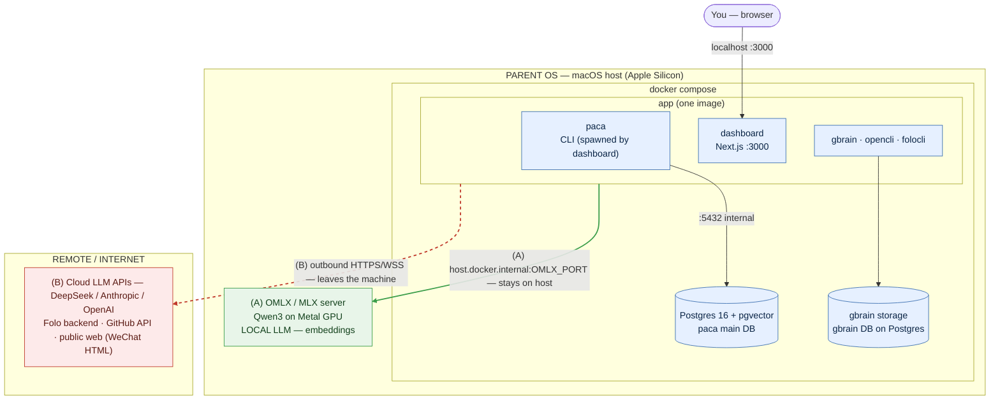

# Containerized Deployment (Cloud-LLM)

How to run the whole `next-signal` stack in an isolated environment
separate from your host OS, using **Docker Compose** with a **cloud LLM backend**
(no local MLX model). This document is design-level: it explains *what* runs
*where* and *why*. It is not a substitute for [operations.md](./operations.md)
(host-native setup) — it is the containerized alternative.

> Scope: single-user, single-host, local-first. Not multi-tenant, not HA. See
> [architecture.md](./architecture.md) for the non-goals that also apply here.

---

## 1. Why Docker Compose (and not a VM)

The deciding constraint is the **local model**. OMLX / Qwen3 runs on Apple's
**Metal GPU** via `mlx-lm`. Neither Docker nor a Linux VM on Apple Silicon can
access Metal — MLX only works on bare-metal macOS. So the local model **cannot
be containerized** at all.

That blocker disappears the moment you commit to the **cloud-LLM path**: every
remaining component (paca, the Next.js dashboard, Postgres, and the Node CLIs)
runs fine in Linux containers, reaching cloud models over HTTPS.

- **Docker Compose** — reproducible (`docker compose up`), declarative, trivially
  isolated from the host's Python/Node/Postgres, easy volume-mounting. This is
  the recommendation.
- **VM (UTM/Lima/Multipass)** — stronger isolation but heavyweight; on macOS your
  containers already run inside a lightweight Linux VM, so a hand-managed VM adds
  cost without much benefit.
- **Bare `uv venv` on host** — least isolation (shares host Postgres/Node/PATH);
  this is what containerizing moves you *away* from.

**Cloud-LLM + Docker is a natural fit; local-LLM + Docker is not.**

---

## 2. Runtime topology

The diagram makes the **parent-OS boundary** explicit. Everything inside the
double line runs on your Mac — both the Docker containers *and* the host-native
process that cannot be containerized (the local LLM server). Only the third
connection class leaves the machine.



**Two connection classes** — the whole point of the boundary:

- **(A) Local LLM — stays on host.** Cloud *chat* runs remote (B), but the
  **embedder is OMLX-only** (info-radar `analyze` dedup). The `app` container
  reaches the host MLX server at `host.docker.internal:<port>`; that traffic
  never leaves your Mac. Omit it and that pipeline degrades (see §7).
- **(B) Remote — the only thing that leaves the machine.** Cloud LLM APIs, the
  Folo backend, the GitHub REST API (knowledge repo lookups), and public-web
  HTTP fetches — outbound HTTPS/WSS from the `app` container.

One service is enough besides Postgres: a single `app` image that bundles
every runnable piece. The dashboard and `paca` **must share one image**
because the dashboard's server actions spawn `paca` CLI children (and shell out
to `gbrain` / `folocli`) as subprocesses — see
`dashboard/lib/actions/spawn-paca.ts`.

---

## 3. Exact placement map

Three buckets — the honest split is not just container vs. host, but also
"external cloud" (neither).

### 3.1 Inside the container(s)

| Component | Container | Notes |
|---|---|---|
| Postgres 16 + pgvector | `postgres` | paca's main DB: agno sessions/memory/traces + business tables |
| paca (Python 3.11 + uv) | `app` | CLI entrypoint, spawned by the dashboard |
| Next.js dashboard | `app` | Built with pnpm, serves `:3000`; spawns `paca` CLI children, so it shares the image |
| gbrain binary | `app` | Bun-compiled from a pinned upstream clone at build time (Bun lives only in the builder stage) |
| opencli (Node) | `app` | `weixin download` uses plain HTTP; no browser bundled or needed |
| folocli | `app` | Pulled via `npx --yes` at runtime; talks to the cloud Folo backend |
| gbrain storage | `postgres` | Its own `gbrain` database on the same Postgres server (`PACA_GBRAIN_DATABASE_URL`). The bun-compiled binary can't run PGLite (extension bundles aren't embedded), and pgvector already ships `vector` + `pg_trgm` — so gbrain uses its Postgres engine |

### 3.2 On the parent OS (host)

| Component | Why it stays on the host |
|---|---|
| Docker Desktop / colima | The container runtime itself |
| `.env` | Mounted read-only into `app`; kept out of the image because it holds live secrets |
| `digitalpaca-wiki/` + `digitalpaca-wiki-raw/` | Knowledge content; bind-mounted so host and container agree. Paths must match `PACA_WIKI_DIR` / `PACA_WIKI_RAW_DIR` *inside* the container |
| `~/.next-signal/` state | knowledge_ingest_manifest.json, agent-tmp/ — named volume (or bind mount) so it survives rebuilds |
| Published ports | `localhost:3000` is how you reach the container |
| **OMLX / MLX model server** *(optional)* | **Cannot be containerized** (needs Metal GPU). Only required for info-radar `analyze` **embeddings**. Cloud chat models do not need it. If used, the container reaches it at `host.docker.internal:<port>` |

### 3.3 External / internet (neither container nor host)

Reached by the `app` container via outbound HTTPS/WSS only — nothing to install:

- **Cloud LLMs:** DeepSeek (primary), with Anthropic/OpenAI as configurable fallback.
- **Folo backend** (folocli's server), **GitHub REST API** (knowledge repo
  lookups), and the **public web** (WeChat article HTML that opencli fetches).

### 3.4 Boundary crossings

- **Container → host:** published port (3000); bind mounts (`.env`, wiki
  dirs); optional `host.docker.internal` calls to a host OMLX server.
- **Container → external:** all LLM + Folo + GitHub + web traffic, outbound only.
- **Persisted state:** `pgdata` and gbrain storage as named volumes; user state as
  a volume or host bind mount.

---

## 4. Sourcing gbrain and opencli

A new user is assumed to clone **only** the `next-signal` repo, so the
`Dockerfile` / `docker-compose.yml` live inside it and the build must fetch the
two peer tools over the network at build time (**pinned-clone**, not vendored).

| | OpenCLI | gbrain |
|---|---|---|
| Upstream | `github.com/jackwener/OpenCLI` | `github.com/garrytan/gbrain` |
| Pin (known-good) | tag `v1.8.1` | commit `a25209b` on `master` (repo ships no release tags) |
| Toolchain | Node + npm | **Bun** |
| Build | `npm install` (its `prepare` hook builds `dist/src/main.js`) | `bun build --compile` → self-contained `bin/gbrain` |

Rules:

- **Pin the refs** (tag or SHA) via build args (`GBRAIN_REF`, `OPENCLI_REF`).
  Never clone a bare `main` — it reintroduces drift and busts caching.
- Both repos are public — no auth needed. The build does require network access.
- **Never copy host build artifacts.** Any local `dist/`, `bin/`, or `node_modules/`
  were built for macOS/arm64 and will not run in a Linux container. The image
  rebuilds them.
- **Multi-stage:** build gbrain + opencli in a builder stage (with Bun + Node),
  copy only the artifacts (the `gbrain` binary; opencli's `dist/` + runtime
  `node_modules`) into the runtime stage.
- **Wire env inside the image:** put `gbrain` on `PATH` (or set `GBRAIN_BIN`), and
  set `OPENCLI_BIN` to the container path of `dist/src/main.js` — overriding the
  host path in `.env`.

---

## 5. Does OpenCLI need a browser?

**No — not for the command paca uses.** OpenCLI has a "Browser Bridge" (a
micro-daemon + Chrome extension) and a CDP mode, both of which attach to a real,
logged-in Chrome *you* provide. But paca only calls `opencli weixin download`
(`src/paca/integrations/knowledge/opencli.py`), whose implementation
(`OpenCLI/src/download/article-download.ts`) fetches over **plain HTTP** and
converts HTML→markdown. Public WeChat Official Account articles are
server-rendered and need no login, so the `app` image stays browser-free —
no Chrome, no Xvfb.

---

## 6. Build → run lifecycle

### Build (image)

1. Linux/arm64 base with Python 3.11; install `uv`, Node 22 + `pnpm`, and (builder
   stage) Bun.
2. Copy dependency manifests first (`pyproject.toml`, `uv.lock`, dashboard
   `package.json` + lockfile); `uv sync` and `pnpm install` — before source — for
   layer caching.
3. Pinned-clone + build gbrain (Bun) and opencli (npm) in the builder stage.
4. Copy application source (paca `src/`, `configs/`, `prompts/`, `scripts/`,
   dashboard app); `pnpm build` the dashboard.
5. Runtime stage copies only artifacts. **Never bake** `.env`, secrets, `state/`,
   `.venv`, host `node_modules`, or wiki content. Use a `.dockerignore`.

### Startup (compose)

6. Start `postgres` first; attach the `pgdata` volume.
7. Gate `app` on Postgres **health** (`depends_on: condition: service_healthy`),
   not just "started".
8. Inject config: `.env` via `env_file` (read-only), `DATABASE_URL` pointing at the
   `postgres` service name, `OMLX_BASE_URL` left unset (→ cloud fallback), wiki
   bind mounts, state volume.

### Entrypoint (every boot, idempotent)

9. Run `scripts/container_bootstrap.sh` — paca's main-DB schema (pgvector
   extension + business tables via `bootstrap_db.py`), then create the `gbrain`
   database and run `gbrain init` (Postgres engine). All idempotent.
10. Optionally run `paca doctor` as a non-fatal log (OMLX / Anthropic will show ✗
    under cloud-only — expected; confirm Postgres / agents / tools are ✔).
11. Launch the long-running process: `paca dashboard --start` (:3000).
12. Publish port 3000 to the host; `restart: unless-stopped`.

Ordering, in one line: **build image → start Postgres → wait healthy → mount
env+wiki+state → bootstrap DB (idempotent) → start dashboard → publish ports →
auto-restart, persist data in volumes.**

---

## 7. Running with Docker

The repo ships `Dockerfile`, `docker-compose.yml`, and `.dockerignore` at its
root. Prerequisites: Docker Engine + Compose v2, and a `.env` (copy from
`.env.example`) with at least a cloud LLM key and `PACA_WIKI_DIR` /
`PACA_WIKI_RAW_DIR` set to the host paths of your wiki repos.

### Quickstart

1. Install/start Docker Engine + Compose v2 (Docker Desktop or colima).
2. `cp .env.example .env`, then edit it: set at least one cloud LLM key
   (DeepSeek/Anthropic/OpenAI) and `PACA_WIKI_DIR` / `PACA_WIKI_RAW_DIR` to the
   host paths of your wiki repos.
3. Build and start the stack:
   ```bash
   docker compose up --build
   ```
4. Wait for `bootstrap` to finish (one-shot, gated on Postgres health) —
   `dashboard` waits for it automatically.
5. Open <http://localhost:3000> for the dashboard.
6. `docker compose down` to stop (keeps `pgdata`/`pstate` volumes); add `-v`
   only if you want to wipe them.

- **Services:** `postgres` (pgvector), `bootstrap` (one-shot schema), `dashboard`
  (`paca dashboard --start`).
- **Config:** `.env` is injected via `env_file` (never baked into the image);
  `DATABASE_URL` and the in-container wiki/state paths are overridden in the
  compose `environment:` block. Peer-tool refs are build args
  (`GBRAIN_REF` / `OPENCLI_REF`).
- **Persistence:** named volumes `pgdata` (Postgres — including the `gbrain`
  database) and `pstate` (`~/.next-signal` state + gbrain `config.json`).
  `docker compose down` keeps them; add `-v` to wipe.

**Local LLM (optional).** Cloud is the default (OMLX unset → DeepSeek/Claude
fallback). To enable the OMLX embedder — required for info-radar `analyze` —
run an OMLX server on the **host** and add to `.env`:
`OMLX_BASE_URL=http://host.docker.internal:<port>/v1`. `host.docker.internal` is
wired for Linux via `extra_hosts: host-gateway`.

**First-build notes.** `openai-whisper` pulls in **torch**; `pyproject.toml`
pins Linux installs to PyTorch's CPU-only wheel index (`tool.uv.sources` /
`tool.uv.index`, see §8) so the build doesn't drag in the CUDA toolkit. If
`pnpm build` fails because a dashboard page prerenders against Postgres/wiki,
switch the `dashboard` command to dev mode: `["paca", "dashboard", "--port", "3000"]`.

---

## 8. Caveats specific to a cloud-only container

1. **The embedder has no cloud fallback.** `paca.core.models.get_embedder` is
   OMLX-only. So info-radar `analyze` dedup **fails** in a pure container (it
   needs `Qwen3-Embedding` for similarity). Chat, agents, and dashboard pages
   work. To enable that pipeline, expose a host/remote OMLX endpoint via
   `OMLX_BASE_URL=http://host.docker.internal:<port>/v1`.
2. **`paca doctor` exits non-zero if any check fails** — treat OMLX / Anthropic ✗
   as expected under cloud-only; do not let it block startup.
3. **Secrets stay out of the image.** `.env` currently holds live keys; mount it at
   runtime, never `COPY` it into a layer or push it.
4. **Per-page dashboard dependencies:** `/goals` and `/design` need only
   Postgres/filesystem; `/radar` needs Postgres populated by `info-radar pull`;
   `/knowledge` needs the gbrain CLI; `/subscriptions` needs Folo auth.
5. **`openai-whisper` → torch is still the biggest single dependency.** whisper is
   used only by the Bilibili ingest integration, and only as an audio-transcription
   fallback for subtitle-less videos (`src/paca/integrations/knowledge/bilibili.py`).
   `pyproject.toml` routes Linux `torch` installs to PyTorch's CPU-only index
   (`tool.uv.sources` / `[[tool.uv.index]]` pointing at
   `download.pytorch.org/whl/cpu`) so the CUDA toolkit + nvidia-*/triton stack
   isn't pulled in — this alone was multiple GB. If you never ingest
   subtitle-less videos, making `openai-whisper`/`torch` optional dependencies
   in `pyproject.toml` shrinks the image further (that one fallback then fails
   loud when hit).

---

## 9. TL;DR

Two containers: `postgres` (`pgvector/pgvector:pg16`) + one `app` image bundling
Python(uv)+paca, Node(pnpm)+dashboard, plus gbrain (Bun-built) and opencli
(HTTP-only), both pinned-cloned from upstream at build time. The host keeps only
the Docker runtime, the mounted files (`.env`, wiki, state), and — *only if you
opt into embeddings* — a host OMLX server. Everything else is either in the
containers or reached as an external cloud API.
