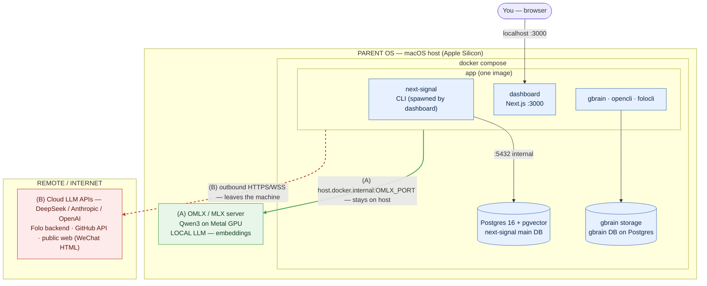

# Containerized Deployment (Cloud-LLM)

> **English** · [中文](./zh/containerized-deployment.md)

How to run the whole `next-signal` stack in an isolated environment
separate from your host OS, using **Docker Compose** with a **cloud LLM backend**
(no local MLX model). This document is design-level: it explains *what* runs
*where* and *why*. It is not a substitute for [operations.md](./operations.md)
(host-native setup) — it is the containerized alternative.

> Scope: single-user, single-host, local-first. Not multi-tenant, not HA. See
> [architecture.md](./architecture.md) for the non-goals that also apply here.

---

## 1. Why Docker Compose (and not a VM)

The deciding constraint is the **local model**. OMLX / Qwen3 runs on Apple's
**Metal GPU** via `mlx-lm`. Neither Docker nor a Linux VM on Apple Silicon can
access Metal — MLX only works on bare-metal macOS. So the local model **cannot
be containerized** at all.

That blocker disappears the moment you commit to the **cloud-LLM path**: every
remaining component (next-signal, the Next.js dashboard, Postgres, and the Node CLIs)
runs fine in Linux containers, reaching cloud models over HTTPS.

- **Docker Compose** — reproducible (`docker compose up`), declarative, trivially
  isolated from the host's Python/Node/Postgres, easy volume-mounting. This is
  the recommendation.
- **VM (UTM/Lima/Multipass)** — stronger isolation but heavyweight; on macOS your
  containers already run inside a lightweight Linux VM, so a hand-managed VM adds
  cost without much benefit.
- **Bare `uv venv` on host** — least isolation (shares host Postgres/Node/PATH);
  this is what containerizing moves you *away* from.

**Cloud-LLM + Docker is a natural fit; local-LLM + Docker is not.**

---

## 2. Runtime topology

The diagram makes the **parent-OS boundary** explicit. Everything inside the
double line runs on your Mac — both the Docker containers *and* the host-native
process that cannot be containerized (the local LLM server). Only the third
connection class leaves the machine.


```mermaid
flowchart TB
    user(["You — browser"])

    subgraph host["PARENT OS — macOS host (Apple Silicon)"]
        direction TB
        subgraph compose["docker compose"]
            direction TB
            subgraph appc["app (one image)"]
                next-signal["next-signal<br/>CLI (spawned by dashboard)"]
                dash["dashboard<br/>Next.js :3000"]
                tools["gbrain · opencli · folocli"]
            end
            pg[("Postgres 16 + pgvector<br/>next-signal main DB")]
            gstore[("gbrain storage<br/>gbrain DB on Postgres")]
        end
        omlx["(A) OMLX / MLX server<br/>Qwen3 on Metal GPU<br/>LOCAL LLM — embeddings"]
    end

    subgraph remote["REMOTE / INTERNET"]
        cloud["(B) Cloud LLM APIs — DeepSeek / Anthropic / OpenAI<br/>Folo backend · GitHub API · public web (WeChat HTML)"]
    end

    user -->|"localhost :3000"| dash
    next-signal -->|":5432 internal"| pg
    tools --> gstore
    appc -->|"(A) host.docker.internal:OMLX_PORT — stays on host"| omlx
    appc ==>|"(B) outbound HTTPS/WSS — leaves the machine"| cloud

    classDef container fill:#e6f0ff,stroke:#3b6fb0,color:#0b2545;
    classDef local fill:#e8f5e9,stroke:#3a9d4a,color:#12401b;
    classDef ext fill:#fdeaea,stroke:#c0392b,color:#5a1a13;
    class next-signal,dash,tools,pg,gstore container;
    class omlx local;
    class cloud ext;
    linkStyle 3 stroke:#3a9d4a,stroke-width:2px;
    linkStyle 4 stroke:#c0392b,stroke-width:2px,stroke-dasharray:5 5;
```

**Two connection classes** — the whole point of the boundary:

- **(A) Local LLM — stays on host.** Cloud *chat* runs remote (B); the embedder
  is selectable and defaults to OMLX (info-radar `analyze` dedup). The `app`
  container reaches the host MLX server at `host.docker.internal:<port>`; that
  traffic never leaves your Mac. Omit it and either select a hosted embedder or
  accept that the dedup gate degrades (see §7).
- **(B) Remote — the only thing that leaves the machine.** Cloud LLM APIs, the
  Folo backend, the GitHub REST API (knowledge repo lookups), and public-web
  HTTP fetches — outbound HTTPS/WSS from the `app` container.

One image is enough besides Postgres: a single `app` image that bundles every
runnable piece. The dashboard and `next-signal` **must share one image** because
the dashboard's server actions spawn `next-signal` CLI children (and shell out
to `gbrain` / `folocli`) as subprocesses — see
`dashboard/lib/actions/spawn-cli.ts`.

That image backs two long-running services plus the one-shot `bootstrap`:
`dashboard` (:3000) and `scheduler`. The **scheduler** runs `next-signal
schedule`, a poll loop that fires the radar chain at a configured wall-clock
time — see [operations](./operations.md#unattended-runs). Putting it in a
container is what makes scheduling portable: host schedulers would mean
maintaining cron, launchd, and Windows Task Scheduler separately, whereas the
container sees the same Linux on all three.

It is deliberately **not** behind a Compose profile. An absent
`~/.next-signal/schedule.json` reads as disabled, so a stack whose operator
never configures a schedule gets an idle container rather than a crash loop.

The corresponding limit: **nothing fires while the host is not running Docker.**
No container can start Docker, so a machine that was asleep or shut down simply
misses the window; the schedule's `catch_up` option softens that by running one
chain once the scheduler is watching again, and cannot do more.

---

## 3. Exact placement map

Three buckets — the honest split is not just container vs. host, but also
"external cloud" (neither).

### 3.1 Inside the container(s)

| Component | Container | Notes |
|---|---|---|
| Postgres 16 + pgvector | `postgres` | next-signal's main DB: agno sessions/memory/traces + business tables |
| next-signal (Python 3.11 + uv) | `app` | CLI entrypoint, spawned by the dashboard |
| Next.js dashboard | `app` | Built with pnpm, serves `:3000`; spawns `next-signal` CLI children, so it shares the image |
| gbrain binary | `app` | Bun-compiled from a pinned upstream clone at build time (Bun lives only in the builder stage) |
| opencli (Node) | `app` | `weixin download` uses plain HTTP; no browser bundled or needed |
| folocli | `app` | Pulled via `npx --yes` at runtime; talks to the cloud Folo backend |
| Codex CLI + Claude Code CLI | `app` | Exact npm versions installed at image build; direct repository tasks and selected production LLM stages use the bounded next-signal bridge |
| gbrain storage | `postgres` | Its own `gbrain` database on the same Postgres server (`GBRAIN_DATABASE_URL`). The bun-compiled binary can't run PGLite (extension bundles aren't embedded), and pgvector already ships `vector` + `pg_trgm` — so gbrain uses its Postgres engine |

Production CLI stages are stricter than direct repository tasks: they run with
provider tools/customizations disabled and see only a fresh empty temporary
directory, not the repository or the read-only `.env` mount.

### 3.2 On the parent OS (host)

| Component | Why it stays on the host |
|---|---|
| Docker Desktop / colima | The container runtime itself |
| `.env` | Mounted read-only into `app`; kept out of the image because it holds live secrets |
| `digitalpaca-wiki/` + `digitalpaca-wiki-raw/` | Knowledge content; bind-mounted so host and container agree. The host sources come from `WIKI_DIR` / `WIKI_RAW_DIR`, defaulting to `./state/wiki` and `./state/wiki-raw` when unset, so the stack starts against an unedited `.env`. Inside the container the paths are always `/wiki` and `/wiki-raw` |
| `~/.next-signal/` state | knowledge_ingest_manifest.json, agent-tmp/, `goals.yaml`, and the settings the dashboard writes — `language.json`, `engine.json`, `coding-agents.json`, `schedule.json`, `embedding.json`. A named volume (or bind mount) so it survives rebuilds. These are the reason the state root cannot be baked into the image: the dashboard writes them at runtime, every reader picks them up at call time without a restart, and they are hand-editable when a panel is not reachable. `goals.yaml` is here for a sharper reason still — `dashboard` and `scheduler` are separate containers off one image, so a write under `/app/configs` would be visible to neither the other service nor the next build |
| Published ports | `localhost:3000` is how you reach the container |
| **OMLX / MLX model server** *(optional)* | **Cannot be containerized** (needs Metal GPU). Required for info-radar `analyze` **embeddings** unless a hosted embedder is selected in Settings. Cloud chat models do not need it. If used, the container reaches it at `host.docker.internal:<port>` |

### 3.3 External / internet (neither container nor host)

Reached by the `app` container via outbound HTTPS/WSS only — nothing to install:

- **Cloud LLMs:** DeepSeek (primary), with Anthropic/OpenAI as configurable fallback.
- **Folo backend** (folocli's server), **GitHub REST API** (knowledge repo
  lookups), and the **public web** (WeChat article HTML that opencli fetches).

### 3.4 Boundary crossings

- **Container → host:** published port (3000); bind mounts (`.env`, wiki
  dirs); optional `host.docker.internal` calls to a host OMLX server.
- **Container → external:** all LLM + Folo + GitHub + web traffic, outbound only.
- **Persisted state:** `pgdata` and gbrain storage as named volumes; user state
  in `pstate`; provider authentication in separate `codex_auth` and
  `claude_auth` named volumes.

---

## 4. Sourcing gbrain and opencli

A new user is assumed to clone **only** the `next-signal` repo, so the
`Dockerfile` / `docker-compose.yml` live inside it and the build must fetch the
two peer tools over the network at build time (**pinned-clone**, not vendored).

| | OpenCLI | gbrain |
|---|---|---|
| Upstream | `github.com/jackwener/OpenCLI` | `github.com/garrytan/gbrain` |
| Pin (known-good) | tag `v1.8.1` | commit `a25209b` on `master` (repo ships no release tags) |
| Toolchain | Node + npm | **Bun** |
| Build | `npm install` (its `prepare` hook builds `dist/src/main.js`) | `bun build --compile` → self-contained `bin/gbrain` |

Rules:

- **Pin the refs** (tag or SHA) via build args (`GBRAIN_REF`, `OPENCLI_REF`).
  Never clone a bare `main` — it reintroduces drift and busts caching.
- Both repos are public — no auth needed. The build does require network access.
- **Never copy host build artifacts.** Any local `dist/`, `bin/`, or `node_modules/`
  were built for macOS/arm64 and will not run in a Linux container. The image
  rebuilds them.
- **Multi-stage:** build gbrain + opencli in a builder stage (with Bun + Node),
  copy only the artifacts (the `gbrain` binary; opencli's `dist/` + runtime
  `node_modules`) into the runtime stage.
- **Wire env inside the image:** put `gbrain` on `PATH` (or set `GBRAIN_BIN`), and
  set `OPENCLI_BIN` to the container path of `dist/src/main.js` — overriding the
  host path in `.env`.

---

## 5. Does OpenCLI need a browser?

**No — not for the command next-signal uses.** OpenCLI has a "Browser Bridge" (a
micro-daemon + Chrome extension) and a CDP mode, both of which attach to a real,
logged-in Chrome *you* provide. But next-signal only calls `opencli weixin download`
(`src/next_signal/integrations/knowledge/opencli.py`), whose implementation
(`OpenCLI/src/download/article-download.ts`) fetches over **plain HTTP** and
converts HTML→markdown. Public WeChat Official Account articles are
server-rendered and need no login, so the `app` image stays browser-free —
no Chrome, no Xvfb.

### 5.1 Pinned coding-agent CLIs

The image installs exact `CODEX_CLI_VERSION` and `CLAUDE_CODE_VERSION` build
arguments (currently `0.145.0` and `2.1.220`) in a dedicated Node stage. It
runs both version commands during the build, copies their launchers and package
directories into the runtime stage, and sets `DISABLE_AUTOUPDATER=1`. Upgrades
are image changes, not mutations inside a running container:

```bash
CODEX_CLI_VERSION=0.145.0 CLAUDE_CODE_VERSION=2.1.220 docker compose build dashboard scheduler
docker compose up -d --force-recreate dashboard scheduler
```

Do not use `latest` in deployment automation. Rebuilding/recreating services
does not remove their saved login because authentication lives in named
volumes, not the image.

---

## 6. Build → run lifecycle

### Build (image)

1. Linux/arm64 base with Python 3.11; install `uv`, Node 22 + `pnpm`, and (builder
   stage) Bun.
2. Copy dependency manifests first (`pyproject.toml`, `uv.lock`, dashboard
   `package.json` + lockfile); `uv sync` and `pnpm install` — before source — for
   layer caching.
3. Pinned-clone + build gbrain (Bun) and opencli (npm), and install exact Codex
   CLI and Claude Code CLI releases, in builder stages.
4. Copy application source (next-signal `src/`, `configs/`, `prompts/`, `scripts/`,
   dashboard app); `pnpm build` the dashboard.
5. Runtime stage copies only artifacts. **Never bake** `.env`, secrets, `state/`,
   `.venv`, host `node_modules`, or wiki content. Use a `.dockerignore`.

### Startup (compose)

6. Start `postgres` first; attach the `pgdata` volume.
7. Gate `app` on Postgres **health** (`depends_on: condition: service_healthy`),
   not just "started".
8. Inject config: `.env` via `env_file` (read-only), `DATABASE_URL` pointing at the
   `postgres` service name, `OMLX_BASE_URL` left unset (→ cloud fallback), wiki
   bind mounts, state volume.

### Entrypoint (every boot, idempotent)

9. Run `scripts/container_bootstrap.sh` — next-signal's main-DB schema (pgvector
   extension + business tables via `bootstrap_db.py`), then create the `gbrain`
   database and run `gbrain init` (Postgres engine). All idempotent.
10. Optionally run `next-signal doctor` as a non-fatal log (OMLX / Anthropic will show ✗
    under cloud-only — expected; confirm Postgres / agents / tools are ✔).
11. Launch the long-running process: `next-signal dashboard --start` (:3000).
12. Publish port 3000 to the host; `restart: unless-stopped`.

Ordering, in one line: **build image → start Postgres → wait healthy → mount
env+wiki+state → bootstrap DB (idempotent) → start dashboard → publish ports →
auto-restart, persist data in volumes.**

---

## 7. Running with Docker

The repo ships `Dockerfile`, `docker-compose.yml`, and `.dockerignore` at its
root. Prerequisites: Docker Engine + Compose v2, and a `.env` (copy from
`.env.example`) with at least a cloud LLM key. `WIKI_DIR` / `WIKI_RAW_DIR` are
optional — leave them blank and Compose mounts `./state/wiki` and
`./state/wiki-raw`; set them to point at your own wiki repos instead.

> **Supported platform: Docker Desktop on macOS and Windows.** Its file-sharing
> layer maps ownership, so the default wiki directories Docker creates are usable
> from both the container and the host. Native Linux Docker Engine runs the daemon
> as root and creates them `root:root` — the stack works, but editing your own
> wiki from the host needs `sudo chown -R $USER state/` once, or `WIKI_DIR`
> pointed at a directory you already own. This is documented rather than
> automated: every fix costs either a `.env` variable or committed placeholder
> directories, and the containerized deployment does not target Linux today.

> **Standing the stack up vs. verifying a change against it.** This section is
> about the former. If you are checking whether an edit works — which loop to run
> for a given change, whether the container is even running your code, which
> commands avoid model spend, and what counts as evidence — see
> [`.claude/skills/docker-verify/SKILL.md`](../.claude/skills/docker-verify/SKILL.md).
> The trap it exists to prevent: `/app` is baked into the image, so editing
> `src/` and re-running `docker compose exec` verifies the *previous* code.

> **Host-specific.** The shell snippets below assume a POSIX shell (zsh on macOS,
> the default since Catalina). On Windows they run under PowerShell, where
> quoting and exit-code handling differ in ways that silently corrupt results —
> the skill above carries the cross-platform table.

### Quickstart

1. Install/start Docker Engine + Compose v2 (Docker Desktop or colima).
2. `cp .env.example .env`, then set at least one cloud LLM key
   (DeepSeek/Anthropic/OpenAI). Leave `WIKI_DIR` / `WIKI_RAW_DIR` blank to use
   the repo-relative defaults, or point them at your own wiki repos.
3. Build and start the stack:
   ```bash
   docker compose up --build
   ```
4. Wait for `bootstrap` to finish (one-shot, gated on Postgres health) —
   `dashboard` waits for it automatically.
5. Open <http://localhost:3000> for the dashboard.
6. Open **Settings → Codex CLI / Claude Code CLI → Connect** once for each
   provider you intend to use; complete the official browser login and paste
   Claude's authorization code back when requested. Explicitly save that CLI's
   model and effort (plus Codex speed), then select the production engine.
7. `docker compose down` to stop (keeps every named volume). Add `-v` only if
   you intentionally want to wipe database, app state, and both CLI logins.

- **Services:** `postgres` (pgvector), `bootstrap` (one-shot schema), `dashboard`
  (`next-signal dashboard --start`), and `scheduler` (`next-signal schedule`).
- **Config:** `.env` is injected via `env_file` (never baked into the image);
  `DATABASE_URL` and the in-container wiki/state paths are overridden in the
  compose `environment:` block. Peer-tool refs and coding-agent versions are
  build args (`GBRAIN_REF`, `OPENCLI_REF`, `CODEX_CLI_VERSION`, and
  `CLAUDE_CODE_VERSION`).
- **Persistence:** named volumes `pgdata` (Postgres — including the `gbrain`
  database), `pstate` (`~/.next-signal` state + gbrain `config.json`),
  `codex_auth` (`/root/.codex`), and `claude_auth` (`/root/.claude`).
  `docker compose down` keeps them; `down -v` wipes all four.

### Coding-agent CLI login

The Dashboard login endpoint is intentionally not a shell. The browser selects
only `codex` or `claude`; server code maps that to `codex login --device-auth`
or `claude auth login --claudeai`, runs it in a bounded PTY, accepts at most one
authorization-code line, and permits navigation only to HTTPS URLs on the
provider's domain allowlist. Transcripts are short-lived memory state and are
not written to `/state` or application logs.

The Compose port binds to `127.0.0.1` by default because login and logout change
credential state. If the Dashboard must be remote, put it behind an
authenticated HTTPS reverse proxy and then set `DASHBOARD_BIND_ADDRESS`
deliberately. Do not publish the port unauthenticated.

If the UI cannot complete a provider flow, use the same mounted volume from the
Dashboard container terminal:

```bash
docker compose exec dashboard codex login --device-auth
docker compose exec dashboard claude auth login --claudeai
docker compose exec dashboard next-signal coding-agent auth-status codex
docker compose exec dashboard next-signal coding-agent auth-status claude
```

Rebuilds and `docker compose down` preserve both logins. To remove one login,
use **Disconnect** in Settings (preferred) or its provider logout command. To
destroy the credential files even if a CLI is broken, remove only the relevant
named volume after stopping services; avoid `docker compose down -v` unless all
Postgres and next-signal state should also be lost.

**Local LLM (optional).** On a cloud-only deployment, select DeepSeek or a
logged-in CLI in Settings (or configure it as the pre-first-response fallback).
To enable the OMLX engine and embedder — required for info-radar `analyze`
semantic dedup — run an OMLX server on the **host** and add to `.env`:
`OMLX_BASE_URL=http://host.docker.internal:<port>/v1`. `host.docker.internal` is
wired for Linux via `extra_hosts: host-gateway`.

**First-build notes.** `openai-whisper` pulls in **torch**; `pyproject.toml`
pins Linux installs to PyTorch's CPU-only wheel index (`tool.uv.sources` /
`tool.uv.index`, see §8) so the build doesn't drag in the CUDA toolkit. If
`pnpm build` fails because a dashboard page prerenders against Postgres/wiki,
switch the `dashboard` command to dev mode: `["next-signal", "dashboard", "--port", "3000"]`.

---

## 8. Caveats specific to a cloud-only container

1. **The embedder is selectable, but never falls back on its own.** It defaults
   to OMLX, so in a pure container info-radar `analyze` dedup **fails** until you
   act — every item then reads as novel. Chat, agents, and dashboard pages work.
   Two ways out:

   - expose a host/remote OMLX endpoint via
     `OMLX_BASE_URL=http://host.docker.internal:<port>/v1`; or
   - open **Settings → Embedding** and select OpenAI (needs `OPENAI_API_KEY`) or
     an OpenAI-compatible endpoint of your own.

   A hosted embedder has two consequences worth deciding on deliberately. Every
   kept item's analysis summary is **sent to that provider** — text that
   otherwise never leaves the machine when OMLX serves both halves — and every
   item **can be billed**, including the unattended scheduler runs nobody is
   watching. There is deliberately no automatic fallback between embedders:
   substituting one silently would change vector space and park the selected
   provider's dedup memory, so a failure stays loud and the item is treated as
   novel.

   Credentials come from the process environment, not from the state file.
   Editing `.env` does **not** reach an already-running container: recreate the
   service (`docker compose up -d --force-recreate dashboard scheduler`) before
   expecting the new value to exist. `docker compose exec dashboard next-signal doctor`
   reports the resolved embedder identity and whether its variable is present,
   without making a model request.
2. **`next-signal doctor` exits non-zero if any check fails** — treat OMLX / Anthropic ✗
   as expected under cloud-only; do not let it block startup.
3. **Secrets stay out of the image.** `.env` currently holds live keys; mount it at
   runtime, never `COPY` it into a layer or push it.
4. **Per-page dashboard dependencies:** `/goals` and `/design` need only
   Postgres/filesystem; `/radar` needs Postgres populated by `info-radar pull`;
   `/knowledge` needs the gbrain CLI; `/subscriptions` needs Folo auth.
5. **`openai-whisper` → torch is still the biggest single dependency.** whisper is
   used only by the Bilibili ingest integration, and only as an audio-transcription
   fallback for subtitle-less videos (`src/next_signal/integrations/knowledge/bilibili.py`).
   `pyproject.toml` routes Linux `torch` installs to PyTorch's CPU-only index
   (`tool.uv.sources` / `[[tool.uv.index]]` pointing at
   `download.pytorch.org/whl/cpu`) so the CUDA toolkit + nvidia-*/triton stack
   isn't pulled in — this alone was multiple GB. If you never ingest
   subtitle-less videos, making `openai-whisper`/`torch` optional dependencies
   in `pyproject.toml` shrinks the image further (that one fallback then fails
   loud when hit).
6. **An existing `pgdata` volume keeps the old `paca` role.** The compose default
   for `POSTGRES_USER` is now `next_signal`, but `POSTGRES_USER` is only honoured
   by `initdb` on an *empty* data directory — a volume created before the
   `next-signal` rename still has only the `paca` role, so every connection fails
   with `role "next_signal" does not exist`. Rename it once, before the new
   default takes effect.

   Postgres refuses to rename the role you are connected as (`ERROR: session
   user cannot be renamed`), and this image creates no second superuser — so the
   rename needs a temporary one:

   ```bash
   docker compose exec -T postgres psql -U paca -d next_signal -c "CREATE ROLE tmp_rename SUPERUSER LOGIN;"
   docker compose exec -T postgres psql -U tmp_rename -d next_signal -c "ALTER ROLE paca RENAME TO next_signal;" -c "ALTER ROLE next_signal WITH PASSWORD 'next_signal';"
   docker compose exec -T postgres psql -U next_signal -d next_signal -c "DROP ROLE tmp_rename;"
   ```

   The second statement is not optional: `ALTER ROLE ... RENAME` clears the
   stored password. Table data is untouched throughout — this renames a role,
   not a schema. To skip the migration entirely, pin `POSTGRES_USER=paca` in
   `.env` instead. Rollback is the same three steps with the names swapped.
   Starting from an empty volume needs none of this.

   One loose end the role rename leaves behind: gbrain caches its own
   `database_url` in `$GBRAIN_HOME/.gbrain/config.json`, and the bootstrap
   script runs `gbrain init --migrate-only` when that file already exists (see
   `scripts/container_bootstrap.sh`) — so the cached URL keeps the old role
   forever. It is harmless under compose, which always injects
   `GBRAIN_DATABASE_URL` and that wins. But any gbrain invocation *without* that
   variable will authenticate as a role that no longer exists. Either keep the
   variable set, or refresh the cache once by deleting that `config.json` and
   re-running the `bootstrap` service.

---

## 9. TL;DR

Two containers: `postgres` (`pgvector/pgvector:pg16`) + one `app` image bundling
Python(uv)+next-signal, Node(pnpm)+dashboard, plus gbrain (Bun-built) and opencli
(HTTP-only), both pinned-cloned from upstream at build time. The host keeps only
the Docker runtime, the mounted files (`.env`, wiki, state), and — *only if you
want local embeddings rather than a hosted one* — a host OMLX server. Everything
else is either in the containers or reached as an external cloud API.
