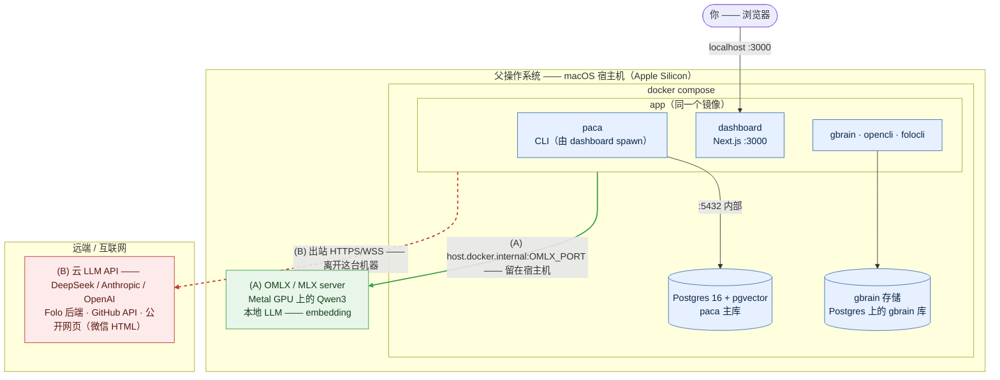

# 容器化部署（Cloud-LLM）

> [English](../containerized-deployment.md) · **中文**

如何用 **Docker Compose** + **云端 LLM 后端**（不跑本地 MLX 模型），把整个
`next-signal` 栈跑在一个与宿主机操作系统隔离的环境里。本文是设计层面的：它解释
*什么*跑在*哪里*、*为什么*。它**不能**替代
[operations.md](./operations.md)（host-native 安装）—— 它是容器化的另一条路径。

> 范围：单用户、单主机、本地优先。不是多租户，不是高可用。
> [architecture.md](./architecture.md) 里的非目标同样适用于这里。

---

## 1. 为什么是 Docker Compose（而不是虚拟机）

决定性的约束是**本地模型**。OMLX / Qwen3 通过 `mlx-lm` 跑在 Apple 的 **Metal GPU**
上。而 Docker 和 Apple Silicon 上的 Linux 虚拟机**都访问不到 Metal** —— MLX 只在
裸机 macOS 上能用。所以本地模型**根本无法容器化**。

一旦你决定走**云 LLM 路线**，这个阻塞就消失了：剩下的每个组件（paca、Next.js
dashboard、Postgres、以及那些 Node CLI）都能在 Linux 容器里正常跑，通过 HTTPS 访问
云端模型。

- **Docker Compose** —— 可复现（`docker compose up`）、声明式、与宿主机的
  Python/Node/Postgres 天然隔离、挂卷简单。这是推荐方案。
- **虚拟机（UTM/Lima/Multipass）** —— 隔离更强但很重；在 macOS 上你的容器本来就跑在
  一个轻量 Linux 虚拟机里，再手工管一个 VM 只增加成本、收益不大。
- **宿主机上裸 `uv venv`** —— 隔离最弱（共享宿主机的 Postgres/Node/PATH）；容器化
  正是要*离开*这种状态。

**云 LLM + Docker 是天然搭配；本地 LLM + Docker 不是。**

---

## 2. 运行时拓扑

下图把**父操作系统边界**画清楚。双线框内的一切都跑在你的 Mac 上 —— 既包括 Docker
容器，*也*包括那个无法容器化的宿主机进程（本地 LLM server）。只有第三类连接会离开
这台机器。



**两类连接** —— 这正是边界的意义所在：

- **(A) 本地 LLM —— 留在宿主机。** 云端跑的是*对话*模型 (B)，但 **embedder 只走
  OMLX**（info-radar `analyze` 的 dedup 需要它）。`app` 容器通过
  `host.docker.internal:<port>` 访问宿主机的 MLX server；这部分流量从不离开你的 Mac。
  不配它，那条 pipeline 就降级（见 §7）。
- **(B) 远端 —— 唯一离开机器的东西。** 云 LLM API、Folo 后端、GitHub REST API
  （knowledge 的 repo 查询）、以及公开网页抓取 —— 都是 `app` 容器的出站 HTTPS/WSS。

除 Postgres 外一个服务就够了：单个 `app` 镜像打包所有可运行部分。dashboard 和
`paca` **必须共用一个镜像**，因为 dashboard 的 server action 会 spawn `paca` CLI
子进程（并 shell out 到 `gbrain` / `folocli`）—— 见
`dashboard/lib/actions/spawn-paca.ts`。

---

## 3. 精确的放置图

三个桶 —— 诚实的划分不只是「容器 vs 宿主机」，还有「外部云」（两者都不是）。

### 3.1 容器内

| 组件 | 容器 | 说明 |
|---|---|---|
| Postgres 16 + pgvector | `postgres` | paca 主库：agno sessions/memory/traces + 业务表 |
| paca（Python 3.11 + uv） | `app` | CLI 入口，由 dashboard spawn |
| Next.js dashboard | `app` | 用 pnpm 构建，服务 `:3000`；会 spawn `paca` CLI 子进程，所以共用镜像 |
| gbrain 二进制 | `app` | 构建时从钉住的上游 clone 用 Bun 编译（Bun 只存在于 builder 阶段） |
| opencli（Node） | `app` | `weixin download` 走纯 HTTP；不打包也不需要浏览器 |
| folocli | `app` | 运行时经 `npx --yes` 拉取；与云端 Folo 后端通信 |
| gbrain 存储 | `postgres` | 同一个 Postgres 服务器上的独立 `gbrain` 库（`PACA_GBRAIN_DATABASE_URL`）。bun 编译出的二进制跑不了 PGLite（扩展 bundle 没有内嵌），而 pgvector 已经带了 `vector` + `pg_trgm` —— 所以 gbrain 用它的 Postgres 引擎 |

### 3.2 父操作系统（宿主机）上

| 组件 | 为什么留在宿主机 |
|---|---|
| Docker Desktop / colima | 容器运行时本身 |
| `.env` | 只读挂载进 `app`；不放进镜像因为里面是真实密钥 |
| `digitalpaca-wiki/` + `digitalpaca-wiki-raw/` | 知识内容；bind-mount 让宿主机和容器保持一致。路径必须和容器*内部*的 `PACA_WIKI_DIR` / `PACA_WIKI_RAW_DIR` 对应 |
| `~/.next-signal/` state | knowledge_ingest_manifest.json、agent-tmp/ —— 用具名卷（或 bind mount）以便重建镜像后仍然保留 |
| 发布的端口 | `localhost:3000` 是你访问容器的方式 |
| **OMLX / MLX 模型服务**（可选） | **无法容器化**（需要 Metal GPU）。只有 info-radar `analyze` 的 **embedding** 需要它。云端对话模型不需要。用的话，容器通过 `host.docker.internal:<port>` 访问 |

### 3.3 外部 / 互联网（既不在容器也不在宿主机）

`app` 容器只通过出站 HTTPS/WSS 访问 —— 无需安装任何东西：

- **云 LLM：** DeepSeek（主），Anthropic/OpenAI 作为可配置的回落。
- **Folo 后端**（folocli 的服务器）、**GitHub REST API**（knowledge 的 repo 查询）、
  以及**公开网页**（opencli 抓取的微信文章 HTML）。

### 3.4 边界穿越

- **容器 → 宿主机：** 发布的端口（3000）；bind mount（`.env`、wiki 目录）；可选的
  `host.docker.internal` 调用到宿主机 OMLX server。
- **容器 → 外部：** 所有 LLM + Folo + GitHub + 网页流量，只出不进。
- **持久化状态：** `pgdata` 和 gbrain 存储用具名卷；用户 state 用卷或宿主机 bind mount。

---

## 4. gbrain 和 opencli 从哪来

假设新用户**只**clone `next-signal` 这一个仓库，所以 `Dockerfile` /
`docker-compose.yml` 放在它里面，构建时必须从网络拉取这两个 peer 工具
（**钉住版本的 clone**，不是 vendor 进来）。

| | OpenCLI | gbrain |
|---|---|---|
| 上游 | `github.com/jackwener/OpenCLI` | `github.com/garrytan/gbrain` |
| 钉住的版本（已验证可用） | tag `v1.8.1` | `master` 上的 commit `a25209b`（该仓库没有 release tag） |
| 工具链 | Node + npm | **Bun** |
| 构建 | `npm install`（它的 `prepare` hook 会构建 `dist/src/main.js`） | `bun build --compile` → 自包含的 `bin/gbrain` |

规则：

- **钉住 ref**（tag 或 SHA），通过构建参数（`GBRAIN_REF`、`OPENCLI_REF`）传入。
  绝不 clone 裸 `main` —— 那会重新引入漂移并破坏缓存。
- 两个仓库都是公开的，不需要认证。但构建过程需要网络。
- **绝不拷贝宿主机的构建产物。** 本地的 `dist/`、`bin/` 或 `node_modules/` 都是为
  macOS/arm64 构建的，在 Linux 容器里跑不起来。镜像会重新构建它们。
- **多阶段构建：** 在 builder 阶段（带 Bun + Node）构建 gbrain + opencli，只把产物
  （`gbrain` 二进制；opencli 的 `dist/` + 运行时 `node_modules`）拷进运行时阶段。
- **在镜像内接好 env：** 把 `gbrain` 放上 `PATH`（或设 `GBRAIN_BIN`），并把
  `OPENCLI_BIN` 设成容器内 `dist/src/main.js` 的路径 —— 覆盖 `.env` 里的宿主机路径。

---

## 5. OpenCLI 需要浏览器吗

**不需要 —— 至少 paca 用的那条命令不需要。** OpenCLI 有「Browser Bridge」（一个
微守护进程 + Chrome 扩展）和 CDP 模式，两者都需要挂到*你*提供的、已登录的真实
Chrome 上。但 paca 只调用 `opencli weixin download`
（`src/paca/integrations/knowledge/opencli.py`），它的实现
（`OpenCLI/src/download/article-download.ts`）走**纯 HTTP** 抓取并把 HTML 转成
markdown。公开的微信公众号文章是服务端渲染的、不需要登录，所以 `app` 镜像保持
无浏览器 —— 不装 Chrome，也不需要 Xvfb。

---

## 6. 构建 → 运行的生命周期

### 构建（镜像）

1. Linux/arm64 基础镜像 + Python 3.11；安装 `uv`、Node 22 + `pnpm`，以及（builder
   阶段）Bun。
2. 先拷依赖清单（`pyproject.toml`、`uv.lock`、dashboard 的 `package.json` + lockfile），
   在拷源码*之前*执行 `uv sync` 和 `pnpm install` —— 为了层缓存。
3. 在 builder 阶段做钉住版本的 clone 并构建 gbrain（Bun）和 opencli（npm）。
4. 拷应用源码（paca 的 `src/`、`configs/`、`prompts/`、`scripts/`、dashboard 应用），
   然后 `pnpm build` 构建 dashboard。
5. 运行时阶段只拷产物。**绝不烘焙** `.env`、密钥、`state/`、`.venv`、宿主机的
   `node_modules` 或 wiki 内容。用 `.dockerignore`。

### 启动（compose）

6. 先起 `postgres`；挂上 `pgdata` 卷。
7. 让 `app` 依赖 Postgres 的**健康状态**（`depends_on: condition: service_healthy`），
   而不只是「已启动」。
8. 注入配置：`.env` 经 `env_file`（只读）、`DATABASE_URL` 指向 `postgres` 服务名、
   `OMLX_BASE_URL` 留空（→ 云回落）、wiki bind mount、state 卷。

### 入口脚本（每次启动，幂等）

9. 跑 `scripts/container_bootstrap.sh` —— paca 主库 schema（pgvector 扩展 + 业务表，
   经 `bootstrap_db.py`），然后创建 `gbrain` 数据库并跑 `gbrain init`（Postgres
   引擎）。全部幂等。
10. 可选地把 `paca doctor` 作为非致命日志跑一次（纯云环境下 OMLX / Anthropic 会显示
    ✗ —— 这是预期的；确认 Postgres / agents / tools 是 ✔ 即可）。
11. 启动长驻进程：`paca dashboard --start`（:3000）。
12. 把端口 3000 发布到宿主机；设 `restart: unless-stopped`。

一句话概括顺序：**构建镜像 → 起 Postgres → 等健康 → 挂 env+wiki+state → bootstrap
数据库（幂等）→ 启动 dashboard → 发布端口 → 自动重启，数据存在卷里。**

---

## 7. 用 Docker 跑起来

仓库根目录已经带了 `Dockerfile`、`docker-compose.yml` 和 `.dockerignore`。
前置条件：Docker Engine + Compose v2，以及一个 `.env`（从 `.env.example` 拷），
里面至少要有一个云 LLM key，以及指向你 wiki 仓库宿主机路径的 `PACA_WIKI_DIR` /
`PACA_WIKI_RAW_DIR`。

### 快速开始

1. 安装并启动 Docker Engine + Compose v2（Docker Desktop 或 colima）。
2. `cp .env.example .env`，然后编辑：至少设一个云 LLM key
   （DeepSeek/Anthropic/OpenAI），以及把 `PACA_WIKI_DIR` / `PACA_WIKI_RAW_DIR`
   设成你 wiki 仓库的宿主机路径。
3. 构建并启动整个栈：
   ```bash
   docker compose up --build
   ```
4. 等 `bootstrap` 跑完（一次性任务，依赖 Postgres 健康）—— `dashboard` 会自动等它。
5. 打开 <http://localhost:3000> 访问 dashboard。
6. `docker compose down` 停止（保留 `pgdata`/`pstate` 卷）；只有想清空它们时才加 `-v`。

- **服务：** `postgres`（pgvector）、`bootstrap`（一次性 schema）、`dashboard`
  （`paca dashboard --start`）。
- **配置：** `.env` 经 `env_file` 注入（绝不烘焙进镜像）；`DATABASE_URL` 和容器内的
  wiki/state 路径在 compose 的 `environment:` 块里覆盖。peer 工具的 ref 是构建参数
  （`GBRAIN_REF` / `OPENCLI_REF`）。
- **持久化：** 具名卷 `pgdata`（Postgres —— 包括 `gbrain` 数据库）和 `pstate`
  （`~/.next-signal` state + gbrain 的 `config.json`）。`docker compose down` 会保留
  它们；加 `-v` 才清空。

**本地 LLM（可选）。** 默认走云（OMLX 未设 → DeepSeek/Claude 回落）。要启用 OMLX
embedder —— info-radar `analyze` 需要它 —— 在**宿主机**上跑一个 OMLX server，然后
在 `.env` 里加：`OMLX_BASE_URL=http://host.docker.internal:<port>/v1`。
`host.docker.internal` 已经通过 `extra_hosts: host-gateway` 为 Linux 接好。

**首次构建注意。** `openai-whisper` 会带进 **torch**；`pyproject.toml` 把 Linux 上的
安装钉到 PyTorch 的纯 CPU wheel 源（`tool.uv.sources` / `tool.uv.index`，见 §8），
这样构建不会把 CUDA 工具链拖进来。如果 `pnpm build` 因为某个 dashboard 页面在预渲染
时访问 Postgres/wiki 而失败，把 `dashboard` 的 command 换成 dev 模式：
`["paca", "dashboard", "--port", "3000"]`。

---

## 8. 纯云容器特有的注意事项

1. **embedder 没有云端回落。** `paca.core.models.get_embedder` 只支持 OMLX。所以在
   纯容器环境里 info-radar `analyze` 的 dedup 会**失败**（它需要 `Qwen3-Embedding`
   算相似度）。对话、agent 和 dashboard 页面都正常。要启用那条 pipeline，通过
   `OMLX_BASE_URL=http://host.docker.internal:<port>/v1` 暴露一个宿主机/远程 OMLX 端点。
2. **`paca doctor` 只要有任何一项失败就退出非零** —— 纯云环境下把 OMLX / Anthropic
   的 ✗ 当作预期，别让它阻断启动。
3. **密钥不进镜像。** `.env` 目前存的是真实 key；运行时挂载，绝不 `COPY` 进某一层，
   也绝不推送出去。
4. **各页面的依赖不同：** `/goals` 和 `/design` 只需要 Postgres/文件系统；`/radar`
   需要 `info-radar pull` 填充过的 Postgres；`/knowledge` 需要 gbrain CLI；
   `/subscriptions` 需要 Folo 认证。
5. **`openai-whisper` → torch 仍然是最大的单个依赖。** whisper 只被 Bilibili ingest
   集成使用，而且只作为无字幕视频的音频转写回落
   （`src/paca/integrations/knowledge/bilibili.py`）。`pyproject.toml` 把 Linux 的
   `torch` 安装路由到 PyTorch 的纯 CPU 源（`tool.uv.sources` / `[[tool.uv.index]]`
   指向 `download.pytorch.org/whl/cpu`），这样 CUDA 工具链 + nvidia-*/triton 那一堆
   不会被拉进来 —— 光这一项就是好几个 GB。如果你从不入库无字幕视频，把
   `openai-whisper`/`torch` 在 `pyproject.toml` 里改成可选依赖能进一步缩小镜像
   （那条回落路径届时会在被触发时 loud fail）。

---

## 9. 一句话总结

两个容器：`postgres`（`pgvector/pgvector:pg16`）+ 一个 `app` 镜像，打包了
Python(uv)+paca、Node(pnpm)+dashboard，外加 gbrain（Bun 构建）和 opencli（纯 HTTP），
两者都在构建时从上游做钉住版本的 clone。宿主机只保留 Docker 运行时、挂载的文件
（`.env`、wiki、state），以及 —— *仅当你选择启用 embedding 时* —— 一个宿主机
OMLX server。其余一切要么在容器里，要么作为外部云 API 被访问。
